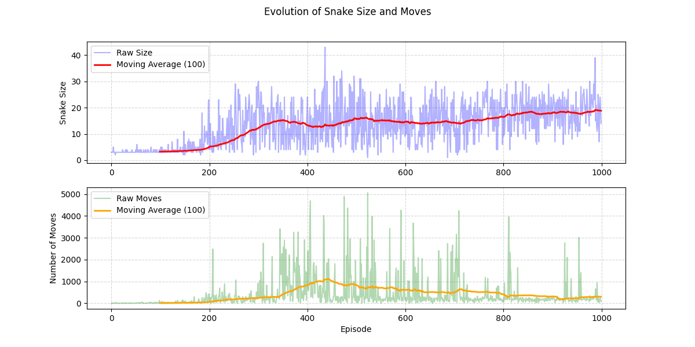

# 🐍 Learn2Slither - Reinforcement Learning Snake Game

## 📖 Overview

**Learn2Slither** is a reinforcement learning project where an AI agent learns to play the classic Snake game using **Q-Learning**. The agent interacts with the environment, receives rewards, and optimizes its policy to maximize performance over time.

---

## ✨ Features

✅ **Q-Learning Implementation** with a reduced state space (256 states).  
✅ **Customizable Grid Size** via command-line arguments.  
✅ **Graphical and Terminal Visualization** options.  
✅ **Training and Evaluation Modes** (with or without learning).  
✅ **Model Saving/Loading** for training persistence.  
✅ **Step-by-Step Mode** for live evaluation of the agent's decisions.  

---

## 📥 Installation

### Clone the Repository
    
```bash
git clone https://github.com/AceHomard/Learn2Slither.git
cd Learn2Slither
```
    
### Create a Virtual Environment (Recommended)
```bash
python -m venv venv  # Create a virtual environment
source venv/bin/activate  # On macOS/Linux
venv\Scripts\activate  # On Windows
```
### Install Dependencies
```bash
pip install -r requirements.txt 
```
---

## 🚀 Usage
Train the Snake

Run the script with:
```bash
python main.py -visual on
```
---

## ⚠️ Important Notice

If `-visual on` is enabled, the **step-by-step mode** is **active by default**.  
- Press **`O`** to **disable** step-by-step mode.  
- Press **`P`** to **re-enable** it.  

In step-by-step mode, you must **press the `Space` bar** to advance each step of the snake's movement.

---
## 📌 Available Arguments

| Argument      | Description                                      | Default |
|--------------|--------------------------------------------------|---------|
| `-visual`    | Enable (`on`) or disable (`off`) the graphical display | `on`    |
| `-load`      | Load a pre-trained model (`.npy` file)           | `None`  |
| `-sessions`  | Number of training episodes                     | `250`   |
| `-dontlearn` | Disable learning (evaluation mode)              | `False` |
| `-dontsave`  | Prevent model saving                            | `False` |
| `-noepsil`   | Disable exploration (always exploit best action) | `off`   |
| `-displayterm` | Show the state matrix in terminal             | `off`   |
| `-grid`      | Set the grid size                               | `10`    |

---
## 🎯 Example Commands

1️⃣ Train for 1000 episodes (fast training without visualization)
```bash
python main.py -visual off -sessions 1000
```
2️⃣ Load a pre-trained model and evaluate
```bash
python main.py -sessions 10 -load models/1000sess.npy -dontlearn -noepsil on
```
---

## 🛠 How It Works

The Snake's environment is simplified into a **4^4 = 256 state space**.

The agent "sees" its surroundings as an encoded vector of values.
## Q-Learning Algorithm
- Exploration vs Exploitation: Uses epsilon-greedy to balance randomness and optimal moves.

- Q-Table Update: The agent updates its Q-table based on rewards:
    > Q(s,a)←Q(s,a)+α[r+γmax⁡Q(s′,a′)−Q(s,a)]
---

## 🎯 Rewards System

| Action                     | Reward  |
|----------------------------|---------|
| Eating a green apple       | `+50`   |
| Eating a red apple         | `-10`   |
| Hitting a wall or itself   | `-50`   |
| Normal move                | `-0.1`  |

---

## 💾 Model Saving & Loading

The model is stored as a .npy file in the models/ directory.

    Save after training: models/{sessions}sess.npy
    Load an existing model: Use -load with the filename.
---
## 📊 Results Visualization

The script generates graphs to analyze learning progress:

📈 Snake length evolution over episodes.

📉 Number of moves per episode.

## 🖼️ Screenshots

### Training Mode (Graphical View)

